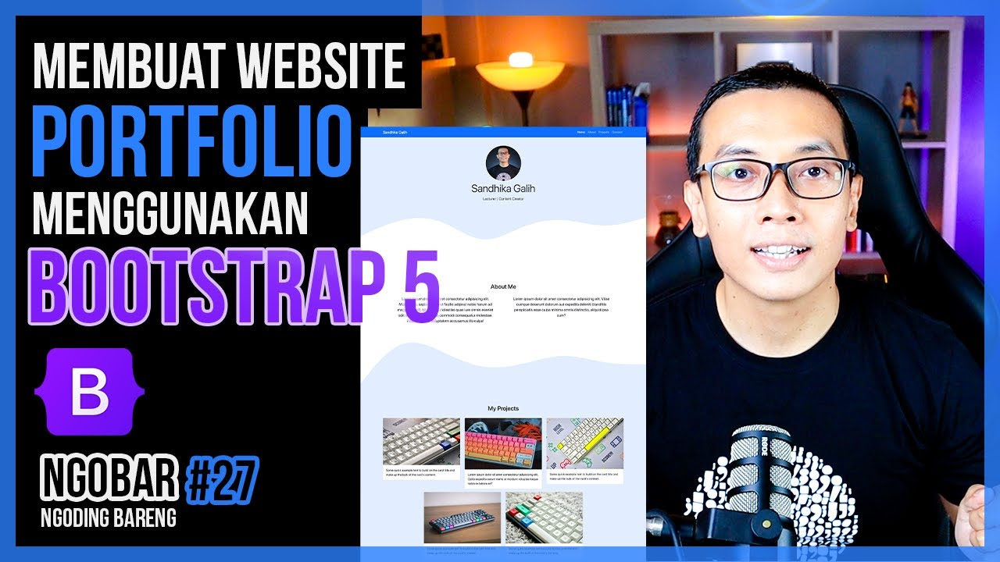

# ❔ about-me

Sebuah website untuk menampilkan deskripsi singkat tentang saya.

- 🛠️ [Teknologi](#techs)
  - [Bulma](#bulma)
  - [Font Awesome](#font-awesome)
  - [Get Waves](#get-waves)
  - [Animate.css](#animate-css)
  - [Animate On Scroll (AOS)](#aos)
- 💡 [Inspirasi](#inspiration)

## 🛠️ Teknologi

Teknologi yang digunakan dalam pengembangan website ini di antaranya:

- [Bulma](https://github.com/jgthms/bulma)

  Mengutip pernyataan resmi dari _Bulma_ :

  > Bulma: the modern CSS framework that just works.

  _Bulma_ adalah salah satu _css framework_ dengan _syntax_ yang mudah dibaca dan mudah diterapkan ke dalam projek kita.

- [Font Awesome](https://fontawesome.com/)

  _Font Awesome_ adalah salah satu penyedia _icon_ yang bisa digunakan untuk memperjelas fungsi dari komponen di _website_ kita, seperti tombol, menu, dan sebagainya.

- [Get Waves](https://getwaves.io/)

  _Get Waves_ adalah layanan untuk melakukan _generate_ gambar bertipe _svg_ , format gambar yang tidak pecah ketika di _zoom-in_ maupun _zoom-out_. Gambar ini dapat digunakan dalam projek _website_ kita maupun projek lain yang membutuhkan gambar.

- [Animate.css](https://animate.style/)

  _Animate.css_ merupakan _library_ untuk memberikan animasi pada _website_ yang kita kembangkan.

- [AOS](https://michalsnik.github.io/aos/)

  Sama seperti _Animate.css_ , _AOS_ juga pada dasarnya sama seperti _library_ tersebut. Yang membedakan adalah secara default, _AOS_ akan memainkan animasi ketika halaman _website_ kita di- _scroll_

## 💡 Inspirasi

Dalam membuat website ini, idenya bukan 100% berasal dari saya. Tetapi, saya terinspirasi dari salah satu video tutorial yang diunggah oleh _channel YouTube_ bernama _Web Programming Unpas_, sebuah _channel_ yang dikelola oleh Bapak Sandhika Galih.

> Berikut adalah link video tutorial yang dimaksud.

